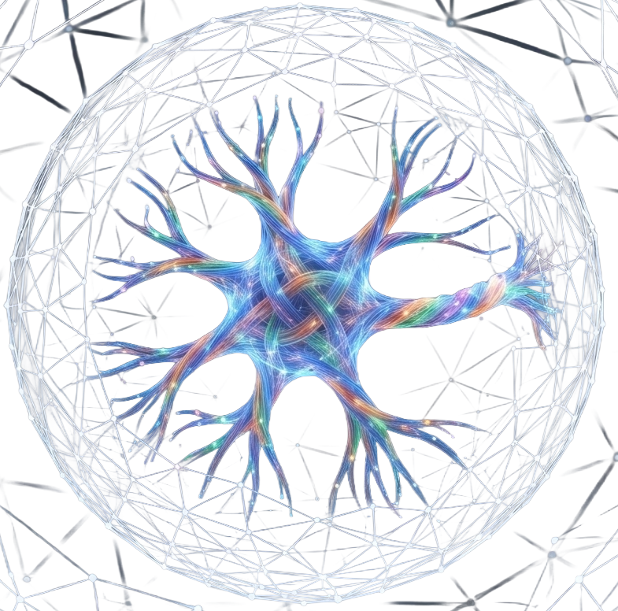

<p align="center">
  
</p>

<p align="center">
  <strong>Verified project state that can travel between AI tasks while source authority and approval stay local.</strong>
</p>

<p align="center">
  <a href="https://drive.google.com/drive/folders/1fRb_FE5EBzGGqZYwdRWtqH6Y2TAAJLfG?usp=sharing"><strong>Download the Windows installer and standalone judge build</strong></a>
  &nbsp;·&nbsp;
  <a href="JUDGE_GUIDE.md">Judge guide</a>
  &nbsp;·&nbsp;
  <a href="KNOWN_LIMITATIONS.md">Known limitations</a>
</p>

<p align="center">
  
</p>

# Evidence Lane

Evidence Lane is a local-first Windows developer tool for carrying a bounded, inspectable project state across AI task windows. It packages a frozen project pointer, selected source records, file hashes, manifests, receipts, and the open human decision. The local working project remains the authority; an AI conversation is a reader of the governed packet, not the owner of project truth.

This repository is the private source-review copy for the OpenAI Build Week submission. Installer and standalone binaries are distributed separately through the Drive link above so the source repository stays reviewable and free of generated binaries.

The publication copy removes generated dependency/build directories and machine-specific receipt paths. Host-bound audit fixtures are routed through explicit environment variables; application logic and runtime assets are retained. See [PUBLICATION_NOTES.md](PUBLICATION_NOTES.md).

## The problem

Long-running AI work often crosses task or context-window boundaries. A prose summary is useful context, but it is not sufficient authority: it can omit the exact files, hashes, pointer, accepted version, unresolved delta, or approval boundary. Evidence Lane treats that missing data packet as the first problem to solve.

## What the current source implements

- A task-scoped project package with a frozen pointer, source/file manifest, and SHA-256 values.
- Package validation before export.
- Hash-linked handoff records containing current and previous pointers, changed files, package hashes, and open state.
- Explicit human decisions: `APPROVE`, `REJECT`, or `SUPERSEDE`.
- Separation of review from promotion: automatic promotion is disabled and a verified approval receipt is required before a separate promotion step.
- Immutable version records that retain previous verified state and bind old/new snapshot hashes.
- A React/TypeScript/Tauri desktop shell with a Python/SQLite embedded backend.
- A 3D Telemetry surface for visual exploration. It is a preview surface, not part of the narrow proof claim for this submission.

The evidence-backed claim is deliberately narrow. This repository does not claim universal provider neutrality, measured token savings, measured speedups, production readiness, or complete clean-machine coverage.

## Judge path — no rebuild required

1. Open the [judge artifact folder](https://drive.google.com/drive/folders/1fRb_FE5EBzGGqZYwdRWtqH6Y2TAAJLfG?usp=sharing).
2. Download either the installer or the standalone executable.
3. Verify the relevant SHA-256 before launch:

   - Installer: `A7741AC3425B6F7A679C64147F015C96592D96565FBAAC5297FB245D5EC95C8E`
   - Standalone candidate: `4A2E8F3F6F608BA7652E1B9774C6D7088B1CC541661C5A759AC8A2F27D4E585C`

4. Follow [JUDGE_GUIDE.md](JUDGE_GUIDE.md) for the bounded package and handoff walkthrough.

The installer is currently unsigned, so Windows may show an unknown-publisher warning. Do not continue unless the downloaded file matches the published hash.

## Build from source

Supported build host: Windows x64.

Prerequisites:

- PowerShell
- Python 3.10 or newer
- Node.js and npm
- Rust/Cargo compatible with Rust 1.77.2 or newer
- Windows C++/Tauri build prerequisites and WebView2

From the repository root:

```powershell
powershell.exe -NoProfile -ExecutionPolicy Bypass -File .\build\BUILD_FULL_APP_EXE.ps1 -BuildInstallerV1
```

The build pipeline installs pinned Python dependencies, runs focused backend tests, creates and verifies the PyInstaller worker, runs `npm ci`, audits and builds the frontend, compiles the Tauri application, and optionally creates the NSIS installer. Generated outputs are written under `build-output/` and are intentionally ignored by Git.

Use `-SkipDependencyInstall` only when the pinned Python requirements are already installed.

## Source layout

```text
backend/
  src/sqlite_brain_builder/   Python/SQLite project-state backend
  tests/                      deterministic and host-bound audit tests
  fixtures/                   self-contained test fixtures
frontend/
  src/                        native wrapper and backend transport
  theme-contract/             UI, motion, and telemetry implementation
  src-tauri/                  Rust desktop host and embedded-worker bridge
build/                        reproducible EXE/installer build and verification tools
installer/                    prerequisite and post-install hooks
docs/assets/                  README artwork
```

Host-bound forensic tests are skipped unless their explicit environment-variable fixtures are supplied. The normal repository tests do not require the original private workstation paths.

## Runtime authority

The production desktop application uses Tauri IPC and a hash-verified embedded worker. A browser is used only for explicit provider website handoffs. The local project, SQLite state, pointer, manifests, and receipts remain the authority.

The intended control flow is:

```text
local project
  → bounded source intake
  → frozen pointer + manifest + hashes
  → validated provider-readable packet
  → later task inspection
  → explicit human decision
  → separate governed promotion
```

<p align="center">
  
</p>

## OpenAI Build Week

Evidence Lane existed before Build Week. During the official event window, Codex and GPT-5.6 Sol at Ultra reasoning were used to trace and edit the package, handoff, embedded-backend, desktop, and approval-receipt paths. The primary feedback session selected for the submission is:

`019f6e61-234c-7d30-84d8-aa2b497c3896`

This session was selected for concentration of demonstrable implementation work, not for transcript length, token count, or patch volume. Human review remained the acceptance authority throughout.

## Known candidate defect

The bundled public-model Env package is not the final current Env definition; it contains mixed historical/current material. Treat provider-package Env contents as a known limitation for this candidate. See [KNOWN_LIMITATIONS.md](KNOWN_LIMITATIONS.md) for the exact boundary.

## Credits and community

Evidence Lane was built with Python, SQLite, React, TypeScript, Three.js, React Three Fiber, Tauri, Rust, Vite, PyInstaller, and the supporting libraries listed in [CREDITS.md](CREDITS.md).

OpenAI ChatGPT, Codex, and GPT-5.6 supported the design, implementation, debugging, and evidence review. The project also recognizes Open WebUI and its community for advancing local, inspectable AI tooling. Open WebUI is not bundled in this repository. Provider handoff surfaces include ChatGPT, Gemini, Codex, and Ollama; provider identity is provenance, not project-change authority.

Third-party projects remain governed by their own licenses and trademarks.

## Repository access and rights

This is a private judge-review repository. Copyright © 2026 Praveen Rathee. All rights reserved. Access for evaluation does not grant permission to redistribute, publish, sublicense, or commercialize the proprietary Evidence Lane source. Third-party components retain their original licenses. See [LICENSE.md](LICENSE.md).

## Work together

Let’s work together to make this stronger: first solve the data packet, then advance further.
